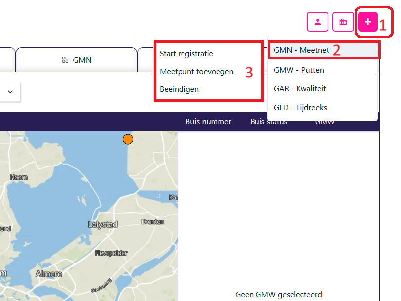

# De BROSTAR Website!

## Introductie

Als gebruiker van BROSTAR is het handig om toelichting te hebben over de verschillende schermen. Hoewel we je bij de onboarding al zoveel mogelijk wegwijs proberen te maken, zal niet alles in één keer te begrijpen zijn. Op deze pagina leggen we de verschillende schermen en tabbladen uit, zodat jij zelf aan de slag kan.

## Het dashboard

Bij het dashboard spreken we over het overzicht dat te bereiken is via: https://www.brostar.nl/. Hierin start je altijd met de kaart als aanzicht, en heb je de verschillende tabbladen (GMW, GMN, GLD, Upload) tot je beschikking. Binnen dit overzicht kan je controleren wat er **op dit moment** in de BRO zit.

!!! Als je niet direct een nieuwe locatie ziet staan, synchroniseer opnieuw je data. Als je ziet dat een taak succesvol is verwerkt, dan is het document doorgeleverd aan de BRO. Dat betekend dat de gegevens al op te halen zijn, ook als die nog niet altijd terug te zien zijn in het BRO-Loket.

### Aanmaken van nieuwe berichten (+)

Het aanmaken van nieuwe berichten gaat via het (+)-teken. Alle nieuwe registraties gaan via dit knopje. Op dit moment worden de volgende berichten ondersteund:

1. GMN: StartRegistratie, Meetpunt, Beeindigen
2. GMW: Constructie, Tussentijdse gebeurtenissen
3. GAR: Aanmaken
4. GLD: StartRegistratie, Aanvulling, Beeindigen

Voor meer informatie over elk van de documenten, ga naar het desbetreffende kopje.

## BRO Tabellen

De verschillende tabellen per bro-domein zijn er om vervang correcties door te voeren op reeds bestaande objecten. In deze tabellen vindt je dus alle in de BRO geregistreerde informatie. Mits je de data hebt gesynchroniseerd. Op dit moment ondersteunen we correcties van:

1. GMN: StartRegistraties
2. GMW: Constructies, Tussentijdse gebeurtenissen
3. GLD: StartRegistratie, Aanvulling

Voor het beeindigen zijn vervang correcties niet direct van toepassing.

### De GMW-Tabel

Deze tabel biedt een overzicht van alle bestaande put leveringen (GMW). Deze tabel is te gebruiken voor het **corrigeren** van gegevens. Hiermee worden dus ReplaceRequests/VervangVerzoeken opgestuurd. Op dit moment ondersteunen we deze berichten zowel voor de constructies van de put, waarmee het BRO-ID normaliter wordt gemaakt. Maar ook voor de tussentijdse gebeurtenissen, zoals het inmeten van je maaiveld. Om dit te doen klik je op het **BRO-ID** in de tabel, die blauw gekleurd is.

Het vervangen van een gebeurtenis kan door op de gebeurtenis naam te klikken. De gebeurtenissen worden pas zichtbaar als je op de put zelf klikt waarvan je de gebeurtenissen wilt bekijken. Je kan zien of een put gebeurtenissen heeft in de kolom _Aantal gebeurtenissen_ of doormiddel van het naar beneden wijzende pijltje aan de rechtkant van een regel.

**Waarom zou je een GMW-Constructie vervangen?**

Goeie vraag! Niet altijd is de initiële levering volledig juist gelopen. Als je hierachter komt wel je deze gegevens corrigeren. Dat is mogelijk met een vervang verzoek. Met een vervang verzoek van de GMW-Constructie kan je vrijwel alle gegevens veranderen. Dit past **niet** de chronologie van de put aan. Dit betekend dat een verandering in de maaiveldhoogte, wat vaak over tijd gebeurt, niet veranderd moet worden met de correctie van een GMW-Constructie, maar met de registratie van een GMW-InmetingMaaiveld (een GMW-Gebeurtenis).

!!! Vindt meer over het aanleveren van GMW-Gebeurtenissen onder ...

**Waarom zou je een GMW-Gebeurtenis vervangen?**

Stel je hebt toch een andere methode positiebepaling aangeleverd dan de werkelijkheid, dan is het handig als je nog een aanpassing kan doen. Of misschien heb je wel een oplenging aan het verkeerde filter gekoppeld, ook dat valt te corrigeren.

### De GMN-Tabel

Hierin laten we de verschillende meetnetten van de geselecteerde organisatie zien. Kijk en zoek snel je meetnet op, om zo eventuele wijzigingen aan je startregistratie door te voeren. Voor ieder meetnet geven we je de belangrijkste informatie:

1. BRO-ID
2. Naam
3. Startdatum
4. Kwaliteitsregime

### De GLD-Tabel

Hierin laten we alle tijdreeksdossiers van de geselecteerde organisatie zien. Voor ieder dossier geven we je de belangrijkste informatie:

1. BRO-ID
2. Put-ID
3. Buisnummer
4. Datum eerste meting
5. Datum laatste meting
6. Kwaliteitsregime
7. Aantal observaties (aanvullingen)

Op het moment dat er aanvullingen onder een tijdsreeksdossier zijn gedaan, dan kan je door op de regel te klikken het dropdown menu openen. Er verschijnt dan een nieuwe tabel met informatie over elke observatiereeks. Zo kan jij voor het juiste bestand een correctie doorvoeren.

Let hierbij wel op: je dient alle metingen uit de reeks aan te leveren, niet alleen de gecorrigeerde waarde.

### De Uploadtaak-tabel

In de upload taak tabel vind je informatie over alle aanleveringen die zijn gedaan onder jou organisatie. Op deze manier krijg je een goed inzicht van hoeveel, hoe vaak en hoe succesvol jou leveringen lopen. Ook krijg je hier feedback op je levering mocht er toch iets niet helemaal correct zijn rondom je waardes.

### GMW-Aanleveringen
Om de grondwatermetingen aan te leveren, moeten eerst de meetnetten aangemaakt worden. Dat wordt eerst via 'GMW-Constructie' gedaan. Tussentijdse gebeurtenissen kunnen daarna aangegeven worden.

#### GMW-Constructie

Hoe werkt een GMW-Constructie? 

Goeie vraag! In een GMW-Constructie geef je alle informatie die nodig is voor het aanmaken van een put in de BRO. Dit is een flinke lijst, en er zijn dus behoorlijk wat gegevens die je zult moeten invullen. Mocht je niet weten wat een bepaald veld betekend, dan is eer een link naar de BRO-Documentatie boven in het scherm. Hier vindt je de informatie van de Basis Registratie zelf.

Een put bestaat uit verschillende onderdelen. Bovenin het formulier vind je alle put informatie. Onderin het scherm kun je monitoringsbuizen toevoegen. Gebruik het plusje om een buis toe te voegen. Mocht je te maken hebben met een zoutwacher, dan kan het zijn dat er een geo-ohmkabel aan je monitoringsbuis vast zit. Deze kan je dan ook weer onderaan toevoegen samen met de elektrodes.

We proberen al wat ondersteuning te bieden door de keuzes te beperken tot het kwaliteitsregime. Echter kunnen BRO-termen soms lastig zijn. Kom je er niet uit? Schroom niet om de [servicedesk](mailto:servicedesk@nelen-schuurmans.nl) te benaderen.

#### GMW-Tussentijdse gebeurtenissen

Hoe werkt een GMW-Tussentijdse gebeurtenis? Dit formulier is gebaseerd op de keuze: 'gebeurtenis type'. Afhankelijk van de waarde van dit veld veranderd het invoer formulier, en het document type dat je opstuurt naar de BRO. Op dit moment worden alle berichten, afgezien van electrode status, ondersteund. Dat zijn er dus 13:

1. Beschermconstructie: Om een wijziging aan de beschermconstructie door te geven. Dit kan ook bij het inkorten of oplengen van een buis.
2. Bepaling maaiveld: Wanneer het maaiveld door natuurlijke omstandigheden verzakt op hoger wordt.
3. Bepaling posities: Wanneer het maaiveld en de buis door natuurlijke omstandigheden verzakken of op worden gehoogd.
4. Buis inplaatsen: Wanneer een buis(deel) wordt ingeplaatst.
5. Buis inkorten: Wanneer een buis wordt afgezaagd.
6. Buis oplengen: Wanneer een buis wordt opgehoogd.
7. Buisstatus: Wanneer de buisstatus veranderd. Hij is bijvoorbeeld plat gereden en niet meer bruikbaar.
8. Eigenaar: Wanneer de buis van eigenaar veranderd. Let op! Dit wijzigd niet de bronhouder, die eindverantwoordelijke is.
9. Inmeting maaiveld: Wanneer tijdens een ronde het maaiveld opnieuw wordt gemeten, maar het maaiveld stabiel is.
10. Inmeting posities: Wanneer tijdens een ronde het maaiveld en/of de buispositie opnieuw wordt gemeten, maar het maaiveld stabiel is.
11. Maaiveld verlegd: Wanneer het maaiveld op onnatuurlijke wijze is opgehoogd of afgegraven.
12. Onderhouder: Wanneer de onderhouder van de locatie is gewijzigd.
13. Opgeruimd: Wanneer de locatie is opgeruimd / verwijderd.

Over het algemeen zijn de invoer velden van deze berichten redelijk eenvoudig, het gaat maar om een beperkt aantal gegevens.

### GMN-Leveringen

Om een GMN levering te volbrengen, dient er informatie aangeleverd te worden via het formulier dat te zien valt bij de roze '+'-knop rechtsbovenin het scherm. Vanuit daar kan men klikken op 'GWN-Meetnet', wat zal resulteren in een formulier dat zich boven de kaart bevindt. vanuit deze knop kan er gekozen worden voor de optie 'Start registratie', 'Meetpunt toevoegen' en 'Beeindigen'. Hieronder wordt ingegaan op deze drie opties.

#### GMN-StartRegistratie

Om een grondwatermeetnet aan te maken dient er op de knop 'Start registratie' te klikken. Dan moet er metadata ingevuld worden. Deze data bevat het Projectnummer, de naam van het project en de interne naam van het project. Deze velden zijn verplicht. In het veld 'bronhouder' dient de partij die eigenaar is van de data aangeklikt worden. Daarna bij 'kader aanlevering' dient aangegeven te worden voor welk project het dient. Het doel van de monitoring moet vermeld worden in de knop daar rechts naast. Er is rechts in het scherm een verdere knop om een meetpunten bestand te uploaden. Dit wordt gebruikt om buizen aan een ander meetnet te voegen.
Een template van dit .csv bestand is alsvolgd.

| measuringPointCode |      broId      | tubeNumber |
|--------------------|-----------------|------------|
| groenerveld-1      | GMW000000003624 | 1          |
| VRD-3              | GMW000000085624 | 3          |

#### GMN-Meetpunt

Een meetpunt kan toegevoegd worden via de knop 'Meetpunt toevoegen'. Vergelijkbare informatie als bij 'Start registratie' zal ingevuld dienen te worden. Daarnaast zal het meetnet waar het meetpunt aan toegevoegd wordt ingevuld dienen te worden.

#### GMN-Beeindigen

Om door te voeren dat een grondwatermeetnet niet meer actief bemeten wordt, dient men op deze knop te drukken. Hierbij dient wederom vergelijkbare informatie gegeven worden zoals bij de twee vorige knoppen.

### GLD-Leveringen
Om de tijdreeksen van grondwaterstanden toe te voegen, wordt de knop GLD - tijdreeks (Groundwater Level Dossier) gebruikt. Vanuit daar zijn er wederom de drie knoppen 'Start registratie', 'Aanvulling' en 'Beeindigen'. 

#### GLD-StartRegistratie
Als er op de knop 'Start registratie' geklikt wordt, komt een formulier tevoorschijn. Hier moet metadata worden ingevuld betreffende iedere tijdreeks. Dat zijn projectnummer, interne naam, het kwaliteitsregime, de specifieke put, de bronhouder en het buisnummer. Daaronder is zichtbaar welke grondwatertijdreeksen er momenteel worden gebruikt. 

#### GLD-Aanvulling
Bij de knop aanvulling moet de .csv van de tijdreeks aangeleverd worden. Hierbij dient als metadata de projectnummer, kwaliteitsregime, BRO-ID tijdreeksdossier en bronhouder ingevuld worden. Als laatste dient het tijdseries bestand aangeleverd te worden. Gebruik hierbij de volgende template als voorbeeld.

| broId            | tijd                     | waarde | statusKwaliteitControle | censuurReden           | censuurLimiet |
|------------------|--------------------------|--------|-------------------------|------------------------|---------------|
| GLD000000012345  | 2025-01-01T14:15:01+0100 | 1,32   | goedgekeurd             |                        |               |
| GLD000000012345  | 2025-01-01T15:15:01+0100 | 4,32   | afgekeurd               | groterDanLimietWaarde  | 3,3           |
| GLD000000012345  | 2025-01-01T16:15:01+0100 | 3,22   | goedgekeurd             |                        |               |
| GLD000000012345  | 2025-01-01T17:15:01+0100 |-1,18   | afgekeurd               | kleinerDanLimietWaarde | -0,5          |

#### GLD-Beeindigen

Om de tijdreeks te beeindigen, moet op deze knop gedrukt worden. Hierbij wordt aangegeven dat de meting niet meer wordt bijgehouden, bijvoorbeeld als een peilbuis verwijderd wordt.

### GAR

De grondwaterkwaliteitsmetingen (GAR) kunnen worden ingeladen via deze knop. Deze knop is wederom te vinden door op de '+'-knop te drukken en daarna op 'GAR - kwaliteit'. Hier dient het formulier ingevuld te worden met als metadata projectnummer, kwaliteitsregime en de bronhouder. Daarna bij gegevens de bemonsteringsoperator, oftewel de partij die het monster neemt. Daarna de procedure en beoordelingsprocedure. Bij bestanden dient het veldwerk bestand en lab bestand geupload te worden.
