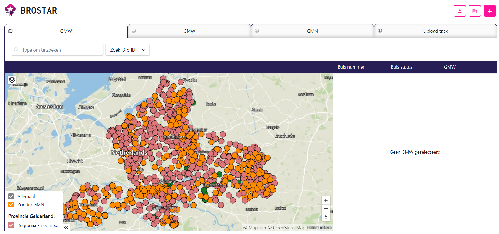
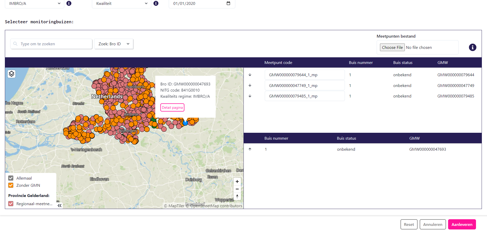

# Introductie

## Welkom op de BROSTAR documentatie!

De BROSTAR is een applicatie die is ontwikkeld door [Nelen & Schuurmans](https://nelen-schuurmans.nl/) om het aanleverproces van data naar de [Basis Registratie Ondergrond (BRO)](https://basisregistratieondergrond.nl/) aanzienlijk makkelijker te maken.

Het aanleveren van data naar de BRO is een technisch process, waarbij kennis van o.a. XML bestanden, scripting en API's vereist is bij de leverancier. Daarom wordt dit proces vaak uitbesteed vanuit de brondhouders. In de praktijk bleek dat hierbij de mate van maatwerk enorm hoog was in verband met eigen manieren van dataopslag, datamodellen, applicaties en data governance. De BROSTAR is een applicatie die door elke organisatie op meerdere manieren ingezet kan worden.

De BROSTAR bestaat uit een [open-source API](https://github.com/nens/brostar-api) en een [closed-source frontend](https://www.brostar.nl/).

## API

!!! note
    Klik [hier](api.md) voor de technische documentatie van de BROSTAR API.

De basis van de BROSTAR is de API. De API heeft 2 belangrijke hoofdfunctionaliteiten:

 - **Import taken**:

    Het is mogelijk om data vanuit de BRO te importeren in de database van de BROSTAR. Het gaat hierbij alleen om metadata van de objecten, en niet van de gehele geschiedenis. In de filosofie van de BROSTAR is de BRO zelf de waarheid en altijd het meest up-to-date. Na een import is het mogelijk om deze gegevens op te vragen en in te zien.

    !!! note
        Het is mogelijk om openbare data van andere organisaties vanuit de BRO te importeren

- **Upload taken**:

    Met behulp van upload taken kan data naar de BRO worden gestuurd. Alle mogelijke berichten worden ondersteund vanuit de API. Het idee van deze functionaliteit is dat je als scripter slechts 1 stap hoeft uit te voeren: het opstellen van een JSON met daarin alle relevante informatie voor het specifieke bericht dat opgestuurd moet worden. Nadat deze als request naar de BROSTAR wordt opgestuurd, wordt de rest afgehandeld. Dit omvat het opstellen van een XML bestand, de validatie, de daadwerkelijke levering, en de voortgang van de levering. De voortgang wordt als status bijgehouden, met eventueel belangrijke logging vanuit de BRO.

De API van de BROSTAR is dus een krachtig hulpmiddel bij zowel managen van bestaande data in de BRO als het aanleveren van de data. Door de BROSTAR te gebruiken wordt een groot deel van het aanleverprocess afgevangen en kan er relatief makkelijk een scripting connectie met de BRO gemaakt worden.

## Frontend

!!! note
    Klik [hier](frontend.md) voor een uitgebreidere functionele documentatie van de frontend.

De frontend is de visuele versie van de BROSTAR. Deze is ontwikkeld zodat ook personen zonder scripting ervaring laagdrempelig data kunnen aanleveren. Dit maakt het mogelijk voor bronhouders om het databeheer zelf in handen te houden.

Als organisatie heb je een eigen omgeving, en kun je eigen data importeren. Net zoals in de API is het ook mogelijk om data van andere organisaties te importeren. Deze data is op een kaart of in een tabel in te zien, en voor sommige type objecten zelfs al gemakkelijk aan te passen:

*BROSTAR homepagina (voorbeeld: Provincie Gelderland)*

Het aanleveren van data via de frontend gebeurt achter de schermen via de API. Na het eenmalig instellen van aanlevertokens voor de BRO, is het als gebruiker is het mogelijk om gebruiksvriendelijke formulieren in te vullen of om Excel bestanden aan te leveren voor bulk uploads. Hieronder is een voorbeeld te zien waarin startregistratie van een GMN geregeld kan worden via een invulformulier. Als gebruiker kun je bovenin metadata van het GMN invullen. Onderin kunnen GMW's op de kaart geselecteerd worden, om vervolgens de relevante buizen te selecteren die als Meetpunt aangeleverd worden.

*GMN startregistratie invulformulier*

Nadat een levering is gedaan, is het mogelijk om de status ervan in te zien. Als een levering niet geslaagd is, kunnen de foutmeldingen vanuit de BRO ingezien worden, om vervolgens de levering aan te passen. Hiermee wordt de gebruiker terug gestuurd naar het ingevulde formulier, waardoor een aanpassing gemakkelijk gemaakt kan worden voordat een nieuwe poging tot levering gedaan kan worden:

*Voorbeeld van de foutmeldingen bij een gefaalde taak. Op de achtergrond zijn succesvolle taken te zien.*

!!! info
    De frontend is nog vol in ontwikkeling. Momenteel zijn de type berichten die mogelijk zijn vanuit de frontend beperkt. Als er vanuit meerdere gebruikers wensen tot uitbreiding zijn, worden deze gerealiseerd.

## Productie vs Demo

Net zoals de BRO zelf, heeft de BROSTAR een [productie](https://www.brostar.nl/) en een [staging](https://www.staging.brostar.nl/) omgeving. De productie van de BROSTAR is op de productie van de BRO gekoppeld en de staging is op de demo van de BRO gekoppeld.

Als je als organisatie een licensie op de BROSTAR neemt, krijg je een eigen omgeving op beide versies. Daarmee is het mogelijk om eerst te testen en te ontwikkelen met dummy data via de demo omgeving.

## Interesse?

Heb je interesse om een demo van de BROSTAR te krijgen of om tijdelijk op de staging omgeving te testen? Contact [info@nelen-schuurmans.com](mailto:info@nelen-schuurmans.com?subject=Interesse in de BROSTAR)
